# 1. Setting for runing environment 
* * *
## 1.1 Requirements
Our Cluster install Apache Spark 2.1.1. and Hadoop-2.7.3.  If you need to run it in other Spark version, just update the spark version in build.sbt file of source code and recompile it.

## 1.2 Building
The code has been writen in Scala and compiled in SBT.

## 1.3 Configuration & Usage
### 1.3.1 Application Configure 

Make a directory: mkdir ./etc and put the config.conf file under it.
Change the configure in config.conf file. 
* rw**  : parameters generate raw time series;
* idx** : parameters generate TARDIS index;
* cl**  : parameters create ground truth for KNN query;
* eq**  : parameters control the exact match query and KNN query;

### 1.3.2 Run code:

Before running promgram:
1. create etc directory and put config.conf file under etc.
2. create log directory.
3. put spark-defaults.conf under the directory or use the default spark program configuration.

~/spark/bin/spark-submit --class org.apache.spark.edu.wpi.dsrg.tardis.TARDIS --properties-file ./spark-defaults.conf  tardis_2.11-1.0.jar -h
* -h : display help information;
* -g : generage raw time series;
* -b : build index;
* -c knn : create ground truth for knn query;
* -q : run time series similiary query;

eqQueryType = exact: exact matching query, knn: kNN-Aproximate query
eqKnnType = 0: target node access, 1: one partition access, 2: multi partitions access

### 1.3.3 Cluster Configure

Change cluster application configure in the spark-defaults.conf   
For whole cluster environment, consult your cluster administor. The configure file should be stored under hadoop/etc/hadoop/ and spark/conf directories.

### 1.3.4 Download

[tardis_2.11-1.0.jar](fig/tardis_2.11-1.0.jar)
\
[source Code](fig/tardis.tar.gz)

# 2. Technical Report
* * *
This technical report is the complement material of TARDIS paper. It involves two parts, the first is the technical part while the the other is the experiment result which is excluded in paper due to space limit. 

This part is unfinished and new content will be added quickly.

## 2.1 Technical
### 2.1.1 Simlarity metric
Similarity queries consider each time series as an entire object rather than individual numerical fields because of the continuous nature of the data. Many similarity metrics have been proposed to measure the objects similarity including Dynamic Time Warping (DTW) and Euclidean Distance (ED). The work in [1] shows that DTW degenerates to simple ED in large datasets because a close match is more likely to be found without warping. Therefore, targeting large scale datasets, we assume the ED similarity metric. In the following, we define the terms used throughout this paper.

*[1] Ding, Hui, et al. "Querying and mining of time series data: experimental comparison of representations and distance measures." Proceedings of the VLDB Endowment 1.2 (2008): 1542-1552.*
    
### 2.1.2 Tardis-G workflow

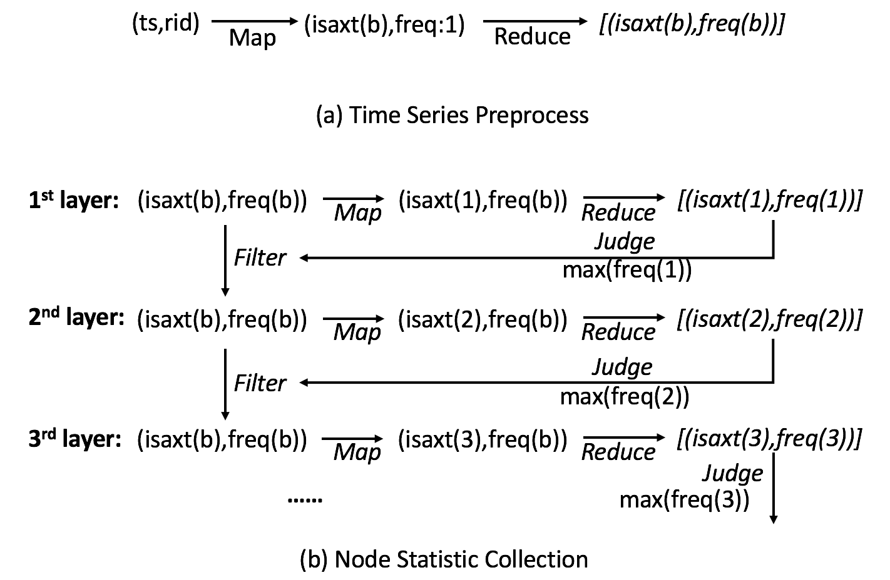

## 2.2 Experiment Result

### 2.2.1. Cluster Index Construction Performance
Total Time for different dataset size
\
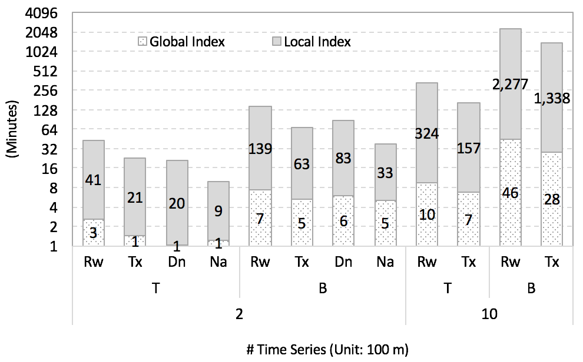

Cluster Global Index breakdown
\
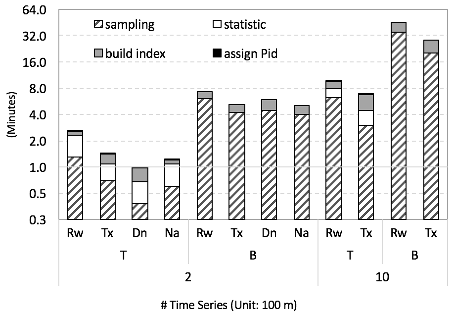

Cluster Local Index breakdown
\
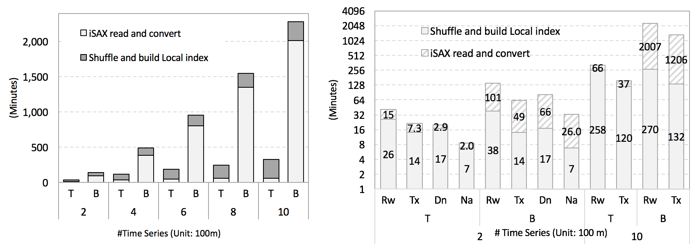

### 2.2.2. Uncluster Index Construction Performance

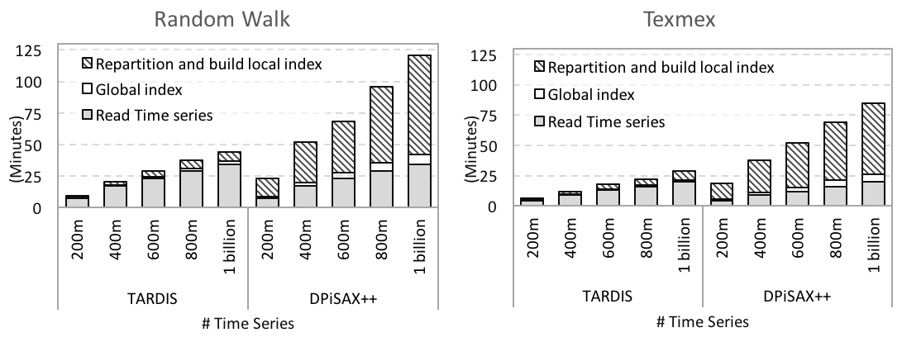

Randwalk Gloabl Index (left) and Local Index (right) breakdown
\
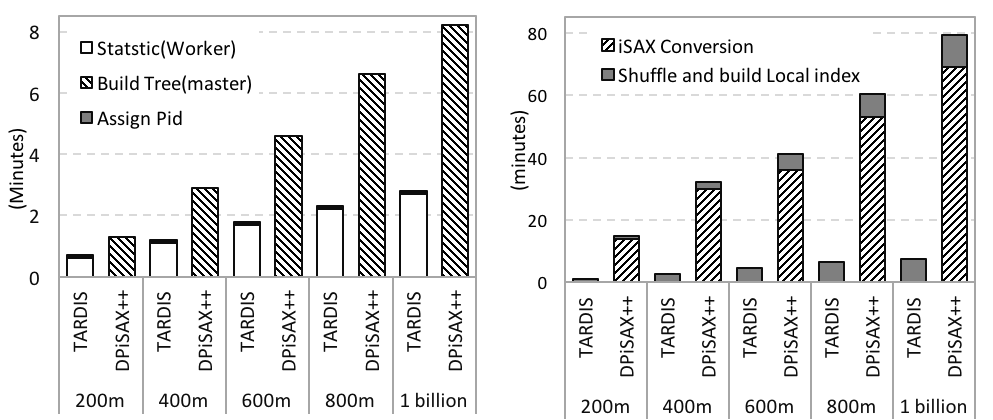
    
Texmex Gloabl Index (left) and Local Index (right) breakdown
\
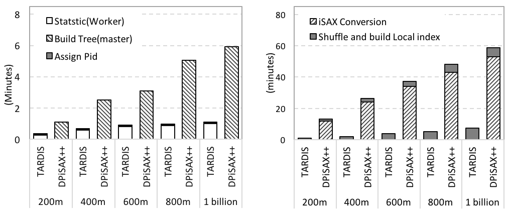

### 2.2.3. Exact Query Process
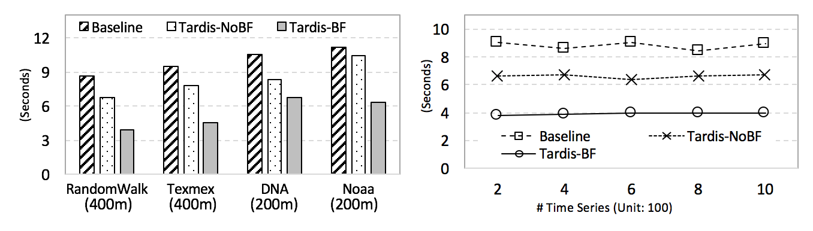

### 2.2.4. kNN-Approximate Process

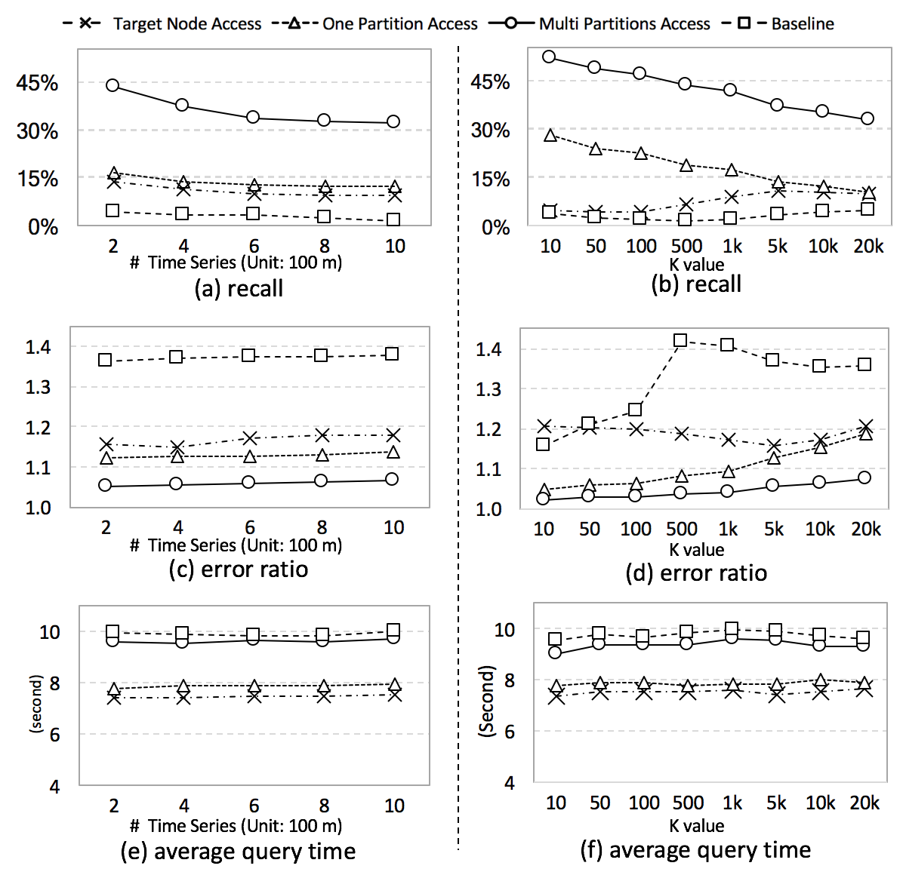

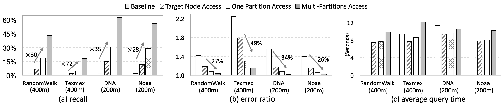

### 2.2.5. Sampling Percent

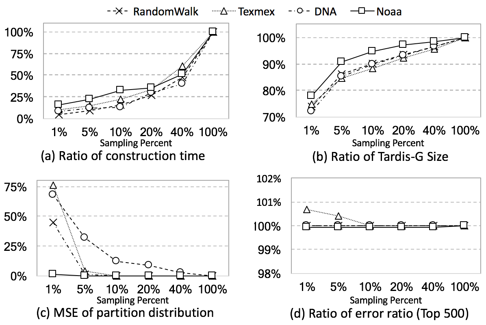
